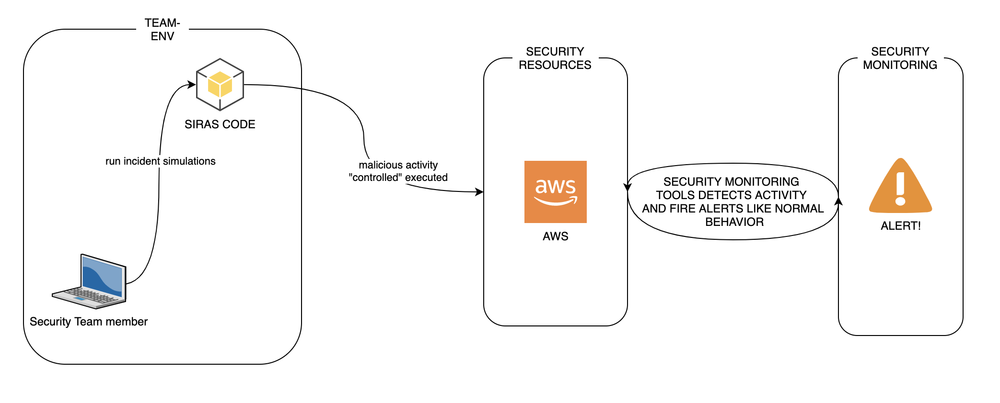

## SIRAS (Security Incident Response Automated Simulations)
Security Incident Response Automated Simulations (SIRAS) are internal/controlled actions that provide a structured opportunity to practice the incident response plan and procedures during a realistic scenarios. the main idea of SIRAS is create an detection-as-a-code testing scenarios to facilitate the blueteam/tabletops scenarios. All smokers of siras make real actions into your AWS and then delete those actions in the same execution.

SIRAS is the `incident response friend` when you need to imprube your capabilitys or test your controls.

## How works?:


##  Why SIRAS?
Currently, the incident detection and response team are developing differents mechanisms to prevent/detect several types of incidents, leaving aside the test stage. Although each alert/automation is tested before implementing it, and it is not constantly monitored.
For this, SIRAS proposes an automated test model where it is expected to trigger alerts in a controlled manner to make security incidents simulation.

## How to run:

1- ACTIVATE VIRTUALENV
```bash
virtualenv siras && source ./siras/bin/activate
```
2- GET HELP
```bash
python3 siras.py -s test
```


## OPTIONS TO RUN (needed)

-s for the "smoker"

| -s  | Description  |
| :------------ |:---------------|
| **all** | run all smokers. |
| **test** | test siras if works. |
| **sg** | Create an open sg into AWS and nuke it. |
| **pa** | Multiple auth failed into vpn paloalto portal (please config "pano_url" into smoker/PanAuthSmoker.py) |
| **au** | Create an adminsitrator user into AWS. |
| **aca** | Multiple auth failed into AWS console portal (please config "account_id" into smoker/awsConsoleAuthSmoker.py) |
| **ctr** | Create and delete a cloudtrail trail loggin.  |
| **s3p** | Create an s3 bucket public. |
| **esb** | Create an esb public snapshot (please config your snapshot ID into smoker/EBSPublicSmoker line27) |

## OPTIONS TO RUN (optional)

| -b (to run) | Description |
| --------------|-------------|
| **True** | save results into s3-bucket. |
| **False** | This is the default, just print the output into the console |

## Requeriments
- Python
- VirtualEnv
- AWS Credentials
- ENV name 'BUCKETS3' to save the logs into that bucket if "true".
- (If you dont want to use virtualenv) pip to install requeriments.txt

## Future Integrations
- Kubernetes smokers
- VPC changes
- EC2 Infected Smoker.
- GuardDuty Changes.

## Request New Modules/Publish
Please feel free to publish or request new modules or use cases, open a ISSUE into the repo or make a PR.